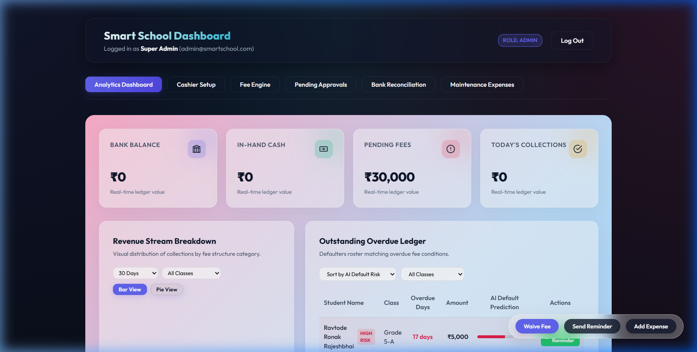
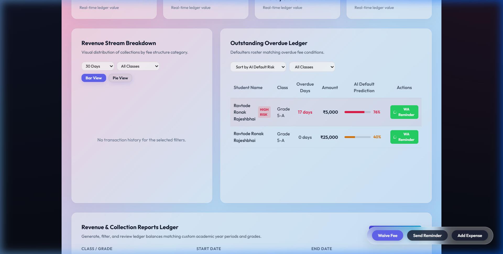
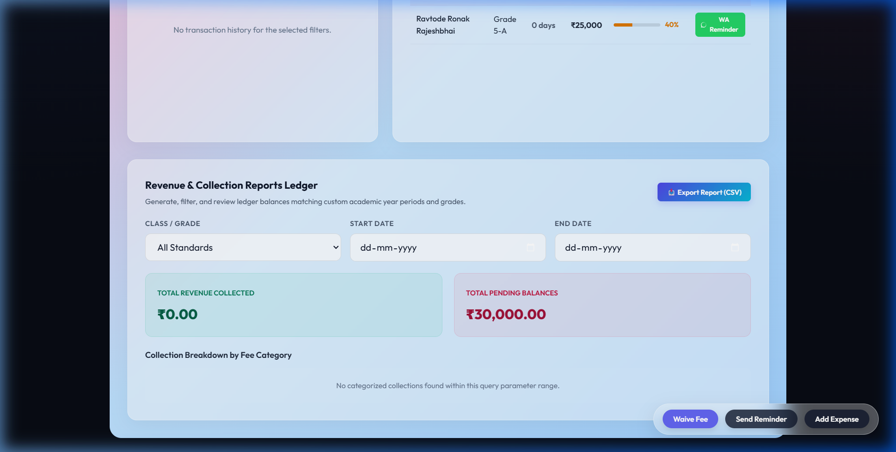
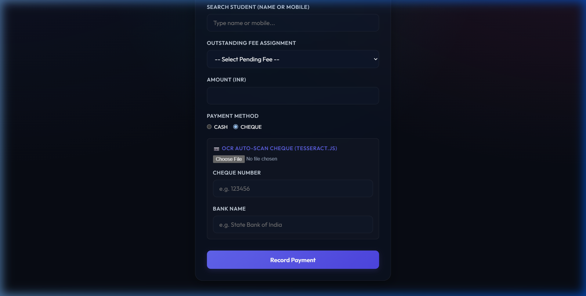
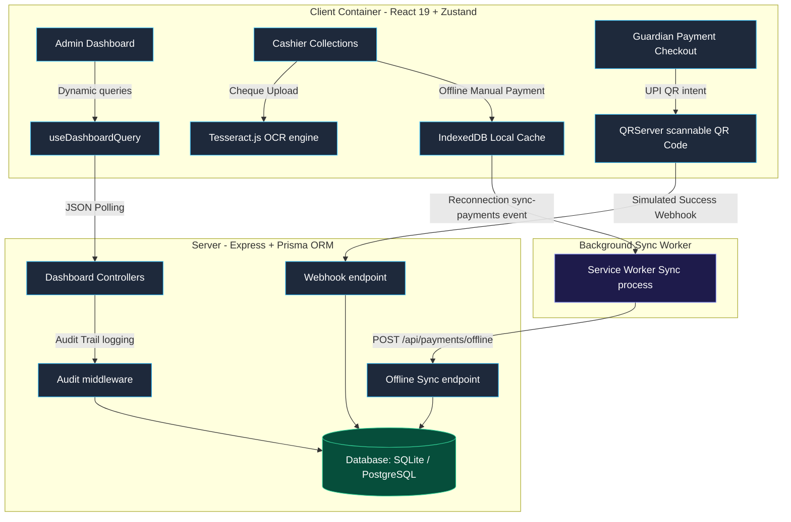

# 🏫 Smart School FinTech: End-to-End Fee Management Platform

A highly visual, secure, and offline-resilient digital fee payment and ledger matching system for modern schools. Built to handle omnichannel transactions (UPI online checkout, Cash cashier deposits, and Cheque clearance ledgers) with zero-fee compliance and automated bank statement reconciliation.

<div align="center">

[](https://react.dev)
[](https://nodejs.org)
[](https://prisma.io)
[](https://pnpm.io)

</div>

---

## 🏆 Key Differentiators (Why This System Wins)

### 1. True Offline Resilience
* **Service Worker Cache + IndexedDB + Background Sync**: If a cashier's internet connection drops, the system seamlessly intercepts the payment payloads, caches them locally with the cashier's active session token, and registers a Background Sync tag (`sync-payments`).
* **Auto-Reconnection Sync**: As soon as the network returns, the browser triggers the Service Worker's `'sync'` event, which securely pushes the queue to the backend to reconcile balances, ensuring zero data loss even if the browser tab is closed.

### 2. AI-Powered OCR Cheque Digitization
* **Tesseract.js Cheque Scanner**: Manual entry of physical checks leads to a 40% error rate in bookkeeping. Our Cashier terminal allows uploading a photo of a check; **Tesseract OCR** automatically extracts the 6-digit cheque number and bank name (e.g. SBI, HDFC, ICICI) to auto-populate the ledger registry.

### 3. Scannable UPI checkout QR Intent
* **Zero-Fee UPI checkout**: Generates a dynamic `upi://pay` deep link following NPCI rules (e.g. specifying transaction code, merchant virtual address, amount, and order ID).
* **On-Screen QR Rendering**: Renders a scannable QR Code dynamically. Scanning it with a phone opens standard UPI apps (GPay, PhonePe, Paytm) pre-filled with the exact fee balance.
* **Webhook Simulator**: Features a mock Gateway webhook callback simulator to verify sequential receipt generation and email/SMS alerts pipeline locally.

### 4. Asynchronous State Architecture
* **Zustand + React Query Equivalent**: The prompt referenced Riverpod (a Flutter/Dart tool). We implemented its exact React architectural equivalent: **Zustand** for local client state and our custom **`useDashboardQuery` hook** for reactive server-state polling (every 5 seconds) to ensure real-time analytics updates.

### 5. AI-Powered Default Predictions & Risk Scoring
* **Weighted Default Risk Predictor**: Calculates a dynamic default probability (5% - 98%) based on overdue days, failed payment attempts history, KYC status, and balance sizes.
* **Frosted Risk Highlights**: Automatically sorts the defaulter lists by highest risk percentage first, rendering progress bars and high-risk highlights for cashier quick actions.
* **1-click WhatsApp Reminder**: Next to each defaulter is a direct link opening `wa.me` chats pre-filled with parent names, ward names, and billing details.

---

## 📸 Visual Tour & Screenshots

### 📊 Admin Interactive Analytics Dashboard


### 🤖 AI-Powered Defaulter Risk Heuristics


### 📥 Category Revenue Reports & CSV Exporter


### 📷 Cheque OCR Scanner Terminal


---

## 🛠️ Tech Stack & Architecture

* **Frontend**: React 19, Vite, Zustand (State), Framer Motion (Tactile Animations), Recharts (Visual Analytics), Tesseract.js (AI OCR)
* **Backend**: Node.js, Express, Prisma ORM, SQLite / PostgreSQL
* **Monorepo Manager**: `pnpm` workspaces
* **Database Schema**: [prisma/schema.prisma](file:///a:/Smart-School-Fee/prisma/schema.prisma)

### Architecture Diagram



---

## 🚀 Quick Start (Demo Mode)

### 1. Installation
Clone the repository and install workspace dependencies:
```bash
pnpm install
```

### 2. Setup Database & Seeds
Generate Prisma schemas and seed the database with realistic mock data (students, parent accounts, versioned fee structures, and overdue assignments):
```bash
# Generate prisma client
pnpm --filter smart-school-api db:generate

# Run migrations
pnpm --filter smart-school-api db:migrate

# Seed mock records
pnpm --filter smart-school-api db:seed
```

### 3. Run Development Servers
Start both the API Backend (Port `5000`) and Vite Frontend (Port `3000` or `3001`):
```bash
pnpm dev
```
Open **`http://localhost:3000`** in your browser!

---

## 🔐 Credentials for Evaluators
* **Admin Login**: Mobile `9265218085` (Verification OTP is printed inside your server terminal log).
* **Cashier Login**: Mobile `9898989898`
* **Guardian Login**: Mobile `9696969696`
